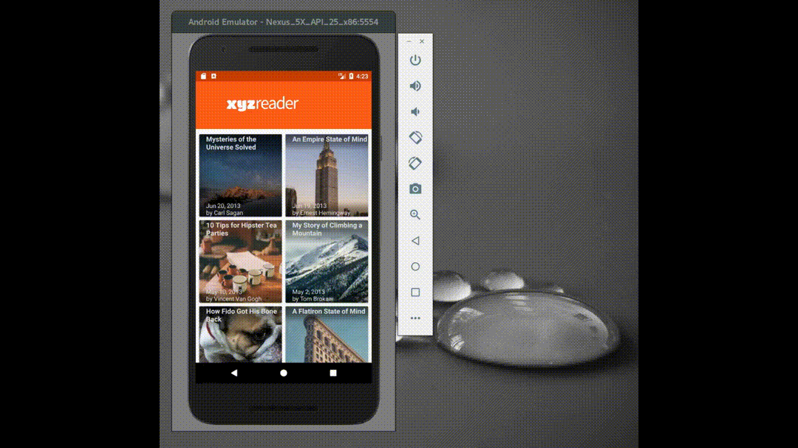
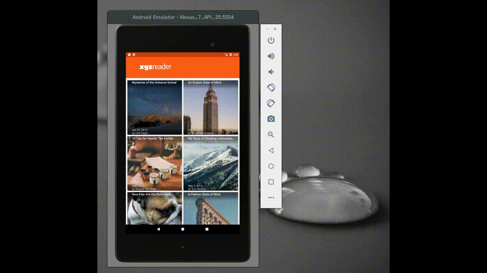

# XYZ Reader

This app is a project for the Make It Material course of Udacity's 
Android Developer Nanodegree program.  The students were given starter code,
which needed a lot of love.  The purpose of the project was to turn the
buggy, ugly starter code into well-functioning, visually-appealing
app by applying Material Design principles and good development practices.

Features:

* Material Design:
  * Activity transitions
  * Background image parallax scrolling effects
  * Custom scrolling view behavior
    * dynamically controls appearance of app logo on when the toolbar collapses
    * dynamically controls article content overlap with background image independent of image size
* Streamlined code

### UI Screenshots

##### Phone Demo

  

  
  
  
  
##### Tablet Demo

  

